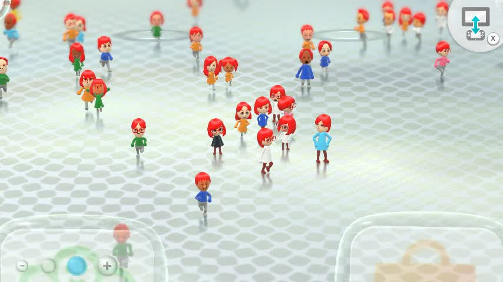
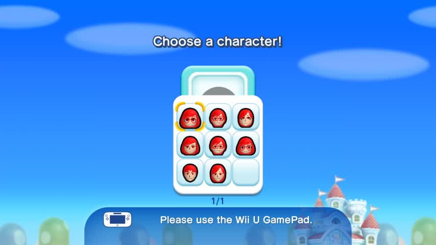
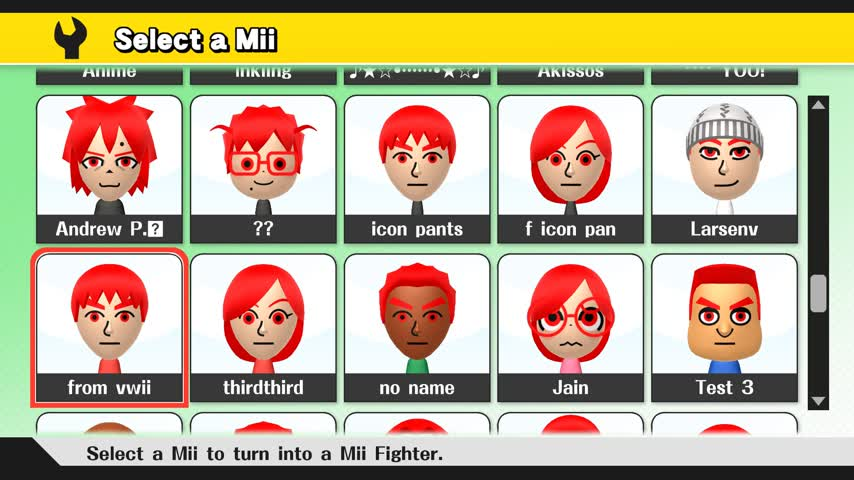
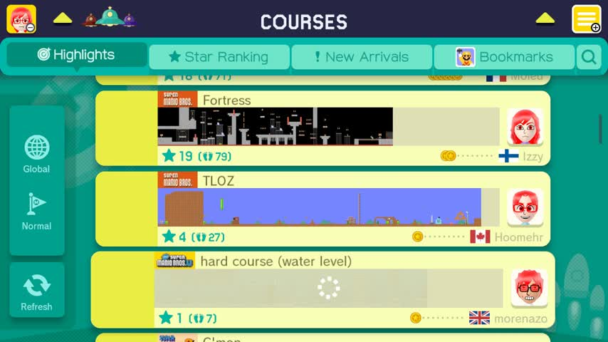
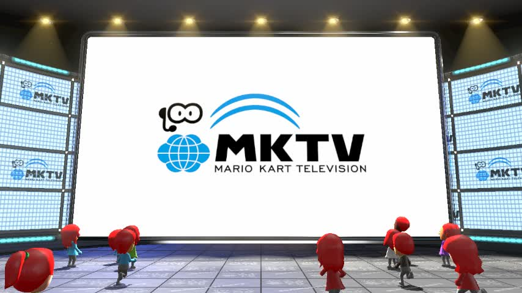
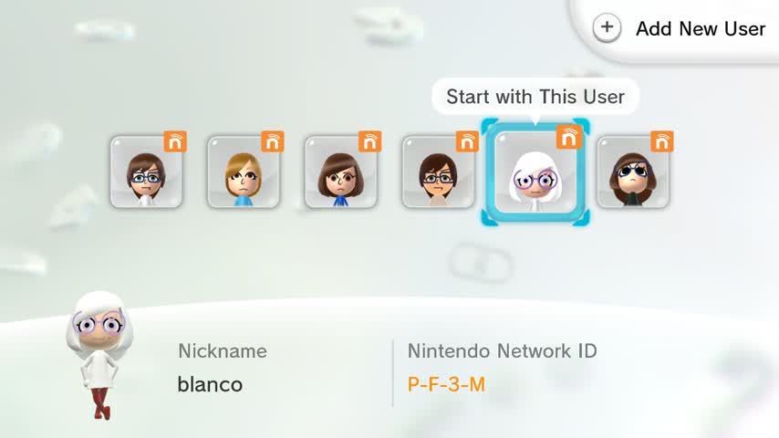
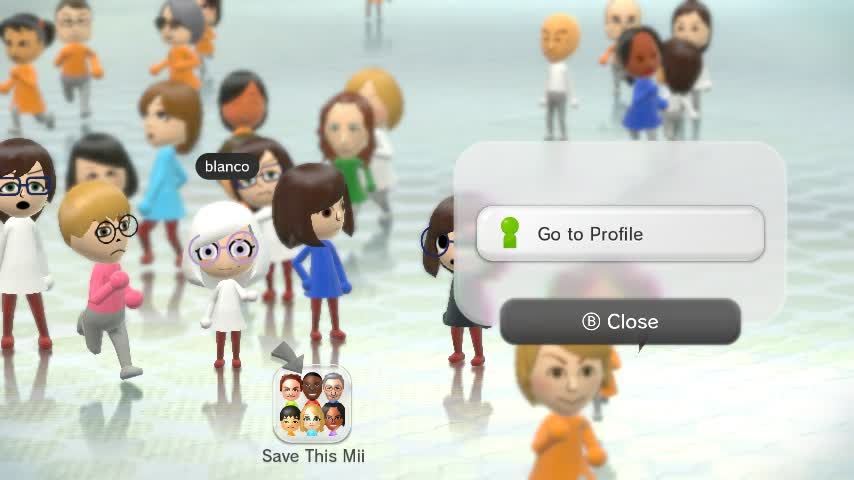
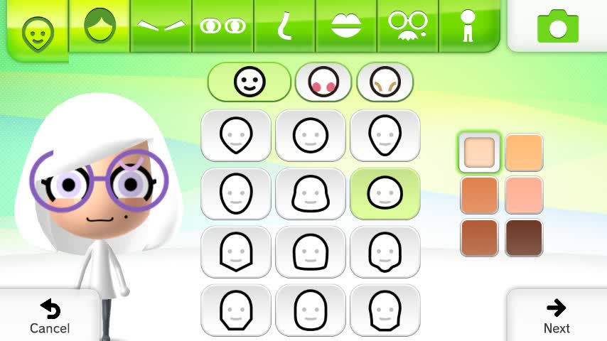
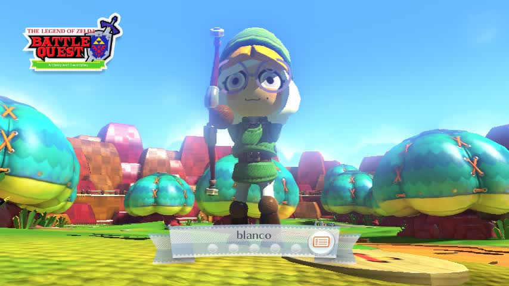

# FFL Mii Patcher plugin for Aroma

This is a plugin I'm making to play with patching FFL (Cafe Face Library), a library statically linked into any title that uses Miis at all. Goal is unclear as of now.

(Most of the README, Makefile, main.cpp etc. are from [example_plugin_cpp](https://github.com/wiiu-env/WiiUPluginSystem/tree/3b1133c9c9626e0b9a30bf890c3e2f66a7bcad51/plugins/example_plugin_cpp))

Currently, it tries to patch FFL (by scanning for function signatures), affecting functions that fetch colors.

## Red Colors Branch

In the `red-colors` branch, this plugin will try to change hair colors in all games. Optionally, skin colors too if you uncomment the patches in ffl_patches.h.

Screenshots: Wii U Menu, New SUPER MARIO BROS. U, Super Smash Bros. for Wii U, Super Mario Maker, Mario Kart 8

    

## eFFSD + Switch Color Support (main)

This allows displaying Switch "Common Colors" stored in the eFFSD format, [which you can read about here](effsd/README.md), for Miis in any game.

Currently there's no way to edit these on the console. So, eFFSD Mii data has to be imported from a QR code, or injected into account.dat.

Screenshots: Wii U Menu, Mii Maker, Nintendo Land

   

### How to create eFFSD Mii data?
Before creating a QR code or injecting into account.dat, to make the raw data you'll need two things:
1. Have existing Mii FFSD data (96-byte, 3DS/Wii U, "Ver3")

To get FFSD Mii data from an existing QR code or NNID/PNID, try [Mii Renderer (REAL)](https://mii-unsecure.ariankordi.net/). Render the Mii, hit "Convert", and copy the Base64 data.

2. Get the Switch color values you want

First, you can use the [color table linked here](https://jsfiddle.net/arian_/za32o6dc/2/) to manually pick the values you want.

Or, you can import them from a Switch Mii inside an amiibo. Use [this jsfiddle](https://jsfiddle.net/arian_/4vj2opfn/20/) to read the amiibo. (Refer to Mii Renderer (REAL)'s amiibo option for instructions.)

On that page, open the JS console before dropping the file. When you do, it should print the color values in the same order the NxInVer3PackCli needs them.

3. Build and use NxInVer3PackCli

The instructions for this are in [effsd/README.md](effsd/README.md). The `pack` command takes the color for each Mii part that has it.

It takes files as input/output, but since it's a CLI, you can use something like this to take Base64 in and out:

`echo -n "BASE64_MII_DATA_HERE" | base64 -d | ./NxInVer3PackCli pack /dev/stdin /dev/stdout 0 99 47 46 19 73 42 3 | base64`

(Only the first 72 bytes of the Mii input/output will be used. This means that the creator name will be lost. You can add it back though, and use the tool below to compute the checksum.)

4. Use the Mii QR code encoder

Go to [this jsfiddle I made for QR encoding](https://jsfiddle.net/arian_/mk5qahvw/5/). Enter the Base64 result from NxInVer3PackCli.

It will show you a QR code of the Mii, but it'll also print out its hex in the console (with checksum). So, you can take this hex and use it in your account.dat to replace the Mii data directly.

If you don't want to do any of this, that's ok. You can use her:

## Installation

(`[ENVIRONMENT]` is a placeholder for the actual environment name.)

1. Requires the [WiiUPluginLoaderBackend](https://github.com/wiiu-env/WiiUPluginLoaderBackend) in `sd:/wiiu/environments/[ENVIRONMENT]/modules`.

## Usage

This plugin currently has no options, and is enabled for all titles. So it's possible that this plugin will cause a certain game to crash if it can't patch it properly. Use with caution.

## Building

For building you need:

- [wut](https://github.com/devkitpro/wut)
- [WiiUPluginSystem](https://github.com/wiiu-env/WiiUPluginSystem)
- [WiiUModuleSystem](https://github.com/wiiu-env/WiiUModuleSystem)
- [libfunctionpatcher](https://github.com/wiiu-env/libfunctionpatcher)
- [libnotifications](https://github.com/wiiu-env/libnotifications/)

Install them (in this order) according to their README's. Don't forget the dependencies of the libs itself.

Then you should be able to compile via `make` (with no logging) or `make DEBUG=1` (with logging).

## Buildflags

### Logging

Building via `make` only logs errors (via OSReport). To enable logging via the [LoggingModule](https://github.com/wiiu-env/LoggingModule) set `DEBUG` to `1` or `VERBOSE`.

`make` Logs errors only (via OSReport).
`make DEBUG=1` Enables information and error logging via [LoggingModule](https://github.com/wiiu-env/LoggingModule).
`make DEBUG=VERBOSE` Enables verbose information and error logging via [LoggingModule](https://github.com/wiiu-env/LoggingModule).

If the [LoggingModule](https://github.com/wiiu-env/LoggingModule) isn't present, it will fall back to UDP (port 4405) and [CafeOS](https://github.com/wiiu-env/USBSerialLoggingModule) logging.
